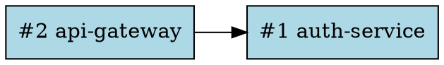

# stAirCase — Getting Started Guide

> **One binary. Zero Python setup pain. AI swarms on your codebase.**

stAirCase orchestrates multi-agent LLM swarms (built on LangGraph) against your source repositories. You describe *what* to build in plain English; a supervisor agent routes specialised workers to read, reason about, and edit your code — with a human-in-the-loop approval gate before every change lands.

---

## Table of Contents

1. [Prerequisites](#1-prerequisites)
2. [Build & Install](#2-build--install)
3. [Smoke Test (no API key)](#3-smoke-test-no-api-key)
4. [Tutorial A — PaymentService Feature](#4-tutorial-a--paymentservice-feature)
5. [Tutorial B — Multi-Service Microservices DAG](#5-tutorial-b--multi-service-microservices-dag)
6. [LLM Providers & Model Selection](#6-llm-providers--model-selection)
7. [Human-in-the-Loop Deep Dive](#7-human-in-the-loop-deep-dive)
8. [Quality Gates Reference](#8-quality-gates-reference)
9. [Inspecting Runs & the SOC2 Event Log](#9-inspecting-runs--the-soc2-event-log)
10. [Maintenance](#10-maintenance)
11. [Troubleshooting](#11-troubleshooting)
12. [Command Reference](#12-command-reference)

---

## 1. Prerequisites

| Requirement | Minimum | Notes |
|---|---|---|
| Go | 1.22+ | For building the binary |
| Python | 3.11+ | Must be on `$PATH` |
| git | 2.x | Must be on `$PATH` |
| Anthropic API key | — | Required for live runs; skip for smoke test |

stAirCase embeds its own Python virtual environment (LangGraph, pydantic, langchain_anthropic) inside `$STAIRCASE_DIR` during `init`. You do **not** need to install any Python packages manually.

---

## 2. Build & Install

```bash
# Clone and build
git clone https://github.com/b070nd/staircase-core.git
cd staircase-core

CGO_ENABLED=0 go build -o staircase ./src/cmd/staircase/
sudo mv staircase /usr/local/bin/
```

Verify:
```
$ staircase version
stAirCase v2.0.0
```

The single static binary ships with no CGo; it uses a pure-Go SQLite driver. No shared libraries required.

---

## 3. Smoke Test (no API key)

This section verifies every layer works correctly without spending a single API token.

### 3.1 — Initialize the workspace

```bash
export STAIRCASE_DIR="$HOME/.staircase"
staircase init
```

Expected output:
```
✅ Workspace initialised at /home/you/.staircase
   🔑 Encryption key generated (.key, mode 0600)
   🐍 Python venv bootstrapped
   📦 Packages installed: langgraph, pydantic, langchain_anthropic
```

### 3.2 — Doctor: verify all subsystems

```bash
staircase doctor
```

Expected output (all green):
```
🩺 stAirCase Doctor — workspace: /home/you/.staircase

  ✅ Workspace directory exists
  ✅ Workspace encryption key (.key)
  ✅ SQLite database (workspace.db)
  ✅ Database schema verified
  ✅ Python venv exists
  ✅ Python (Python 3.12.3)
  ✅ Python package "langgraph"
  ✅ Python package "pydantic"
  ✅ Python package "langchain_anthropic"
  ✅ git in PATH (git version 2.45.1)
  ⚠  tmp/ directory  — will be created on first run

✅ All checks passed. Ready to orchestrate.
```

The `tmp/` warning is benign — the directory is created on first `compile` or `run`.

### 3.3 — Register a vendor + project

For the smoke test, use any git repository on your machine. We will **not** run it, just verify the data pipeline.

```bash
# Use an existing local repo, or create a throwaway one
mkdir -p /tmp/my-app && cd /tmp/my-app && git init && touch README.md && git add . && git commit -m "init"

staircase vendor add acme
# ✅ Vendor #1 "acme" created.

staircase project add acme my-app --source /tmp/my-app
# ✅ Project #1 "my-app" created under vendor "acme".
#    Source path: /tmp/my-app
```

### 3.4 — Register a topology

A *topology* defines the agent graph: which agents exist, how they connect, and what routing logic to use.

```bash
staircase topology register 1 supervisor --checkpoint memory --runtime langgraph
# ✅ Topology v1 registered for project #1 (supervisor=supervisor, checkpoint=memory)

staircase topology agent add 1 supervisor "Route tasks to the right specialist agent" --model claude-opus-4-6
staircase topology agent add 1 coder "Read, reason about, and edit source code" --model claude-sonnet-4-6

staircase topology edge add 1 supervisor coder
staircase topology edge add 1 coder supervisor
```

Verify the graph:
```bash
staircase topology show 1
```
```
Topology v1 — project #1 (supervisor=supervisor, checkpoint=memory, runtime=langgraph)

Agents
  ID  Name        Role                                          Model
  ─────────────────────────────────────────────────────────────────────
  1   supervisor  Route tasks to the right specialist agent    claude-opus-4-6
  2   coder       Read, reason about, and edit source code     claude-sonnet-4-6

Edges
  supervisor → coder  (unconditional)
  coder → supervisor  (unconditional)
```

### 3.5 — Create a case and set a PRD

A *case* is a bounded unit of work. Its PRD (Product Requirements Document) is the prompt the swarm acts on.

```bash
staircase case new 1
# ✅ Case #1 created for project #1 (status: PENDING)

cat > /tmp/prd.txt << 'EOF'
Add a /healthz HTTP endpoint that returns {"status": "ok", "version": "1.0"}
EOF

staircase case set-prd 1 /tmp/prd.txt
# ✅ PRD attached to Case #1 (127 bytes)
```

### 3.6 — Compile (no API calls)

`compile` generates the LangGraph Python execution script from the topology + case data. Zero API calls — it's purely local.

```bash
staircase compile 1
```
```
⚙️  Compiling case #1  project="my-app"
   📦 Dependency order: my-app
   🕸  Topology v1  supervisor="supervisor"  checkpoint=memory
   ✅ Generated: /home/you/.staircase/tmp/graph_exec_case1.py
   🚀 Run with:  staircase run 1
```

Inspect the generated file to understand what the swarm will execute:
```bash
head -80 "$STAIRCASE_DIR/tmp/graph_exec_case1.py"
```

You should see the Python LangGraph harness with your agents, roles, and the built-in tools (`read_file`, `list_dir`, `request_edit`).

### 3.7 — Run quality gates

```bash
staircase gate 1
```
```
Quality Gate Report — case #1
Run at: 2026-03-25T14:22:01Z

CATEGORY      GATE                                  SEVERITY   STATUS  MESSAGE
──────────────────────────────────────────────────────────────────────────────────────────
structural    prd_not_empty                         BLOCK      ✅ PASS   PRD is set
structural    topology_exists                       BLOCK      ✅ PASS   Topology v1 registered
structural    topology_has_agents                   BLOCK      ✅ PASS   2 agent(s) defined
structural    topology_has_edges                    BLOCK      ✅ PASS   2 edge(s) defined
structural    supervisor_in_topology                BLOCK      ✅ PASS   supervisor "supervisor" is a node
structural    script_compiled                       BLOCK      ✅ PASS   graph_exec_case1.py exists (topo v1)
security      workspace_key_exists                  BLOCK      ✅ PASS   .key present
security      python_venv_exists                    BLOCK      ✅ PASS   venv/bin/python exists
runtime       project_source_path_set               WARN       ✅ PASS   source_path is set
runtime       source_path_is_git_repo               WARN       ✅ PASS   /tmp/my-app is a git repo
dependency    no_dependency_cycles                  BLOCK      ✅ PASS   DAG is acyclic

──────────────────────────────────────────────────────────────────────────────────────────
Overall: ✅ PASS
Summary: 11 pass, 0 warn, 0 fail, 0 skip

✅  All BLOCK gates passed. Safe to run.
```

**The smoke test is complete.** You have verified the full pipeline — init, topology registration, case creation, compilation, and gate checks — without spending a single API token.

---

## 4. Tutorial A — PaymentService Feature

**Scenario:** You're building a payments API. You want stAirCase to add Stripe webhook signature verification to your existing FastAPI service using a 3-agent swarm: supervisor routes, a coder implements, a reviewer checks for security issues.

### 4.1 — Setup (one time per machine)

```bash
export STAIRCASE_DIR="$HOME/.staircase"
staircase init
staircase secret set ANTHROPIC_API_KEY sk-ant-api03-...
```

Secrets are encrypted with AES-256-GCM and stored in the workspace database. The Python process receives the plaintext value at runtime — the encrypted blob never leaves Go.

### 4.2 — Register the project

```bash
# Assumes you have a local clone of your payments repo
staircase vendor add mycompany
staircase project add mycompany payments-api --source /home/you/code/payments-api
# ✅ Project #1 "payments-api" created under vendor "mycompany".
```

### 4.3 — Design the agent topology

```bash
# Register topology (supervisor name must match the agent you register as supervisor)
staircase topology register 1 supervisor --checkpoint memory --runtime langgraph

# Supervisor — routes work, decides when to finish
staircase topology agent add 1 supervisor \
  "You are the orchestrator. Analyse the PRD and repo context, then route to 'coder' to implement and 'reviewer' to verify. Call 'coder' first, then 'reviewer'. When reviewer approves, route to END." \
  --model claude-opus-4-6

# Coder — implements changes
staircase topology agent add 1 coder \
  "You are a senior Python engineer. Use list_dir and read_file to understand the codebase, then use request_edit to make precise, minimal changes. Focus only on what the PRD requests." \
  --model claude-sonnet-4-6

# Reviewer — security and correctness review
staircase topology agent add 1 reviewer \
  "You are a security-focused code reviewer. Use read_file to inspect changes. Check for: injection vulnerabilities, missing input validation, secrets in code, and correctness. Reply APPROVED or CHANGES NEEDED with specific feedback." \
  --model claude-sonnet-4-6

# Edges — supervisor fans out, agents return to supervisor
staircase topology edge add 1 supervisor coder
staircase topology edge add 1 supervisor reviewer
staircase topology edge add 1 coder supervisor
staircase topology edge add 1 reviewer supervisor
```

### 4.4 — Create a case with the feature PRD

```bash
staircase case new 1
# ✅ Case #1 created for project #1

cat > /tmp/stripe-webhook-prd.md << 'EOF'
## Feature: Stripe Webhook Signature Verification

**Goal**: Add HMAC-SHA256 signature verification to the existing /webhooks/stripe
endpoint in app/routes/webhooks.py.

**Requirements**:
1. Read STRIPE_WEBHOOK_SECRET from environment (already set by ops team)
2. Verify the Stripe-Signature header using stripe.Webhook.construct_event()
3. Return HTTP 400 with {"error": "invalid signature"} if verification fails
4. Return HTTP 400 with {"error": "payload too large"} if body > 512KB
5. Existing webhook handling logic must remain unchanged
6. Add a unit test in tests/test_webhooks.py covering both the happy path
   and the signature failure case

**Do not**:
- Change any other routes
- Add new dependencies (stripe-python is already in requirements.txt)
- Modify the database layer
EOF

staircase case set-prd 1 /tmp/stripe-webhook-prd.md
staircase story add 1 "Verify Stripe-Signature header using HMAC-SHA256"
staircase story add 1 "Reject oversized payloads (>512KB) with HTTP 400"
staircase story add 1 "Unit tests cover happy path and signature failure"
```

### 4.5 — Add user stories for tracking

```bash
staircase story list 1
```
```
ID  Status   Description
────────────────────────────────────────────────────────────────────
1   PENDING  Verify Stripe-Signature header using HMAC-SHA256
2   PENDING  Reject oversized payloads (>512KB) with HTTP 400
3   PENDING  Unit tests cover happy path and signature failure
```

### 4.6 — Compile + gate

```bash
staircase compile 1
staircase gate 1
```

If all gates pass:
```
✅  All BLOCK gates passed. Safe to run.
```

### 4.7 — Run

Make sure your working tree is clean before starting:
```bash
cd /home/you/code/payments-api
git status   # must show "nothing to commit"
```

```bash
staircase run 1
```
```
🚀 Run #1  case=1  branch=main
   🌿 Blast-radius branch: staircase/run-1
   🔌 IPC socket: /home/you/.staircase/tmp/run-1.sock
   🐍 Python PID=48291
```

The swarm is now running. stAirCase creates a `staircase/run-1` git branch in your repo — all agent changes are isolated there until you merge.

### 4.8 — Human-in-the-Loop approval

When an agent calls `request_edit` to modify a file, stAirCase pauses and presents a TUI:

```
╔══════════════════════════════════════════════════════════╗
║  HITL YIELD REQUEST                              Run #1  ║
╠══════════════════════════════════════════════════════════╣
║  Agent:    coder                                         ║
║  Action:   file_edit                                     ║
║  File:     app/routes/webhooks.py                        ║
║  Confidence: 0.94                                        ║
╠══════════════════════════════════════════════════════════╣
║  Reasoning:                                              ║
║  Adding stripe.Webhook.construct_event() verification    ║
║  at the top of the handler, before any DB operations.    ║
║  Using raw request body as required by Stripe's SDK.     ║
╠══════════════════════════════════════════════════════════╣
║  [A]pprove   [R]eject   [F]eedback                       ║
╚══════════════════════════════════════════════════════════╝
```

Press **A** to approve. The edit is applied atomically (search-and-replace, CRLF-normalised). Press **F** to send a feedback message back to the agent.

### 4.9 — After the run

On success:
```
✅ Run #1 completed.
```

stAirCase auto-commits the changes to `staircase/run-1` in your repo. Review and merge:

```bash
cd /home/you/code/payments-api
git diff main..staircase/run-1
git checkout main
git merge --no-ff staircase/run-1 -m "feat: stripe webhook verification (staircase run #1)"
```

Check story status:
```bash
staircase story list 1
```
```
ID  Status       Description
────────────────────────────────────────────────────────────────────
1   IMPLEMENTED  Verify Stripe-Signature header using HMAC-SHA256
2   IMPLEMENTED  Reject oversized payloads (>512KB) with HTTP 400
3   IMPLEMENTED  Unit tests cover happy path and signature failure
```

---

## 5. Tutorial B — Multi-Service Microservices DAG

**Scenario:** You have two Go microservices: `auth-service` and `api-gateway`. `api-gateway` depends on `auth-service` (it calls auth APIs). You want a single case that can read context from both when making changes to the gateway.

### 5.1 — Register both services

```bash
staircase vendor add mycompany   # (if not already done)

staircase project add mycompany auth-service --source /home/you/code/auth-service
# ✅ Project #1 "auth-service" created

staircase project add mycompany api-gateway --source /home/you/code/api-gateway
# ✅ Project #2 "api-gateway" created
```

### 5.2 — Declare the dependency

```bash
# api-gateway (#2) depends on auth-service (#1)
staircase project dep add 2 1
# ✅ Dependency #1: project #2 → project #1
```

### 5.3 — Visualise the DAG

```bash
staircase dag viz
```


Pipe to `dot` to render:
```bash
staircase dag viz | dot -Tpng -o dag.png && open dag.png
```

### 5.4 — Register topology on the gateway project

```bash
staircase topology register 2 supervisor --checkpoint memory --runtime langgraph
staircase topology agent add 2 supervisor "Route to coder to implement. Route to END when done." --model claude-opus-4-6
staircase topology agent add 2 coder "Senior Go engineer. Read both services' code via list_dir and read_file before making changes." --model claude-sonnet-4-6
staircase topology edge add 2 supervisor coder
staircase topology edge add 2 coder supervisor
```

### 5.5 — Create and compile a case

```bash
staircase case new 2
# ✅ Case #1 created for project #2

cat > /tmp/gateway-prd.txt << 'EOF'
Add a /auth/validate-token proxy endpoint to api-gateway that:
1. Forwards the Authorization header to auth-service's /internal/validate endpoint
2. Caches successful validation results for 30 seconds using a simple in-memory TTL map
3. Returns 401 if auth-service returns non-2xx
EOF

staircase case set-prd 1 /tmp/gateway-prd.txt
staircase compile 1
```

During `compile`, stAirCase:
1. Traverses the dependency DAG: `api-gateway → auth-service`
2. Generates a `RepoMap` skeleton of **both** services
3. Packs the combined context into the Python script as `<context>` XML

The coder agent sees the auth-service's `internal/validate` endpoint signature without any manual prompt engineering.

```
⚙️  Compiling case #1  project="api-gateway"
   📦 Dependency order: auth-service → api-gateway
   🕸  Topology v1  supervisor="supervisor"  checkpoint=memory
   ✅ Generated: /home/you/.staircase/tmp/graph_exec_case1.py
```

### 5.6 — Run

```bash
staircase gate 1
staircase run 1
```

---

## 6. LLM Providers & Model Selection

stAirCase supports multiple LLM providers **per agent** — different agents in the same swarm can use different vendors. The provider is inferred automatically from the model name prefix; the corresponding secret key is fetched through the encrypted IPC channel at runtime.

### Supported providers

| Model prefix | Provider | Secret key name | LangChain package |
|---|---|---|---|
| `claude-*` | Anthropic | `ANTHROPIC_API_KEY` | `langchain-anthropic` |
| `gpt-*`, `o1-*`, `o3-*`, `o4-*` | OpenAI | `OPENAI_API_KEY` | `langchain-openai` |
| `gemini-*` | Google | `GOOGLE_API_KEY` | `langchain-google-genai` |
| `grok-*` | xAI | `XAI_API_KEY` | `langchain-xai` |

All provider packages are installed into the workspace venv during `staircase init` — no manual `pip install` required.

### Registering API keys

```bash
# Anthropic (Claude)
staircase secret set ANTHROPIC_API_KEY sk-ant-api03-...

# OpenAI (ChatGPT / GPT-4o / o3)
staircase secret set OPENAI_API_KEY sk-proj-...

# Google (Gemini)
staircase secret set GOOGLE_API_KEY AIza...

# xAI (Grok)
staircase secret set XAI_API_KEY xai-...
```

Secrets are encrypted with AES-256-GCM and stored in `workspace.db`. The Python process receives the plaintext through the authenticated IPC channel — the encrypted blob never leaves the Go process.

### Current model recommendations

| Use case | Recommended model | Notes |
|---|---|---|
| Supervisor / orchestration | `claude-opus-4-6` | Best reasoning, highest token cost |
| Code implementation | `claude-sonnet-4-6` | Strong code quality, good speed |
| Fast routing / review | `claude-haiku-4-6` | Low latency, lowest cost |
| OpenAI alternative (coding) | `gpt-4o` | Strong multi-language support |
| Budget OpenAI | `gpt-4o-mini` | Very fast, very cheap |
| Google alternative | `gemini-2.0-flash` | Excellent speed/cost ratio |
| xAI | `grok-3` | Strong at code, large context |

### Mixed-provider example

Different agents in the same topology can use different providers:

```bash
staircase topology register 1 supervisor --checkpoint memory --runtime langgraph

# Orchestration: use Claude Opus for best reasoning
staircase topology agent add 1 supervisor \
  "Route tasks to coder or reviewer. Call END when reviewer approves." \
  --model claude-opus-4-6

# Implementation: use GPT-4o as the coder
staircase topology agent add 1 coder \
  "Senior engineer. Read the codebase, then edit files to implement the PRD." \
  --model gpt-4o

# Review: Gemini Flash for fast, cheap review passes
staircase topology agent add 1 reviewer \
  "Security reviewer. Check for vulnerabilities and correctness. Reply APPROVED or CHANGES NEEDED." \
  --model gemini-2.0-flash

staircase topology edge add 1 supervisor coder
staircase topology edge add 1 supervisor reviewer
staircase topology edge add 1 coder supervisor
staircase topology edge add 1 reviewer supervisor
```

Each agent fetches only its provider's key — a coder using `gpt-4o` only needs `OPENAI_API_KEY`; it never touches `ANTHROPIC_API_KEY`.

### Project-scoped secrets

If different projects use different API keys (e.g., separate billing accounts):

```bash
staircase secret set ANTHROPIC_API_KEY sk-ant-api03-team-a-key --project 1
staircase secret set ANTHROPIC_API_KEY sk-ant-api03-team-b-key --project 2
```

Project-scoped secrets take precedence over the global fallback.

---

## 7. Human-in-the-Loop Deep Dive

### Interactive TUI (default)

When running interactively, each `request_edit` call pauses the swarm and shows the approval TUI. You have three options:

| Key | Action |
|-----|--------|
| `A` | Approve — edit is applied, swarm continues |
| `R` | Reject — edit is not applied; rejection reason sent to agent |
| `F` | Feedback — enter a text message guiding the agent, then it retries |

### Webhook mode (CI/CD integration)

For automated pipelines, set a webhook URL on the project. stAirCase will POST yield requests to your endpoint and expect a synchronous JSON response:

```bash
staircase project set-webhook 1 https://your-review-bot.internal/staircase/yield
```

Your endpoint receives:
```json
{
  "type": "yield_request",
  "agent_name": "coder",
  "action_type": "file_edit",
  "reasoning_trace": "Adding signature verification before DB call",
  "confidence_score": 0.94
}
```

Respond with:
```json
{
  "type": "yield_response",
  "approved": true,
  "feedback": ""
}
```

Or to reject with guidance:
```json
{
  "type": "yield_response",
  "approved": false,
  "feedback": "Do not modify the handler signature — keep the existing FastAPI dependency injection"
}
```

Clear the webhook to return to TUI mode:
```bash
staircase project set-webhook 1
```

### Auto-stash for pre-run dirty trees

If your working tree has uncommitted changes, stAirCase refuses to run by default (blast-radius isolation guarantee). Use `--auto-stash` to handle this automatically:

```bash
staircase run 1 --auto-stash
```

This stashes your changes before the swarm runs and pops the stash when it finishes (success or failure).

---

## 8. Quality Gates Reference

`staircase gate <case-id>` runs 17 quality checks in 4 categories. Gates with severity `BLOCK` must pass for `staircase run` to proceed.

### Categories

| Category | What it checks |
|---|---|
| `structural` | PRD set, topology registered, agents/edges defined, supervisor present, compile script current |
| `security` | Workspace key exists, Python venv present |
| `runtime` | Source path set and is a valid git repo |
| `dependency` | DAG is acyclic |

### Machine-readable output

```bash
staircase gate 1 --json
staircase gate 1 --json --out report.json
```

### Bypassing in emergencies

```bash
staircase run 1 --skip-gates   # use with care; documents your override intent
```

### Dry-run validation

```bash
staircase run 1 --dry-run
```

Validates and prints the execution plan (socket path, branch name) without launching Python or spending tokens.

---

## 9. Inspecting Runs & the SOC2 Event Log

### List all runs

```bash
staircase inspect runs
staircase inspect runs --case 1
```
```
ID  Case  Status   Branch             Topo  Started          Duration
─────────────────────────────────────────────────────────────────────────────
3   1     SUCCESS  staircase/run-3    1     2026-03-25 14:31  2m18s
2   1     FAILED   staircase/run-2    1     2026-03-25 14:12  0m45s
1   1     SUCCESS  staircase/run-1    1     2026-03-25 11:04  3m02s
```

### Verify the tamper-proof event log

Every state emission from the Python process is written to an append-only SOC2 event log. Each entry is chained with SHA-256: `hash = SHA256(payload + prevHash + gitCommitHash)`.

```bash
staircase inspect log 3
```
```
Run #3  case=#1  status=SUCCESS  branch=staircase/run-3
         commit=a3f8b1c2d4e5f6a7b8c9d0e1f2a3b4c5d6e7f8a9

✅ #1    state_emit      14:31:02  a3f8b1c2d4e5f6…
     {"active_agent": "supervisor", "step": 0}
✅ #2    state_emit      14:31:08  7c9d2e4f1b3a5c…
     {"active_agent": "coder", "step": 1, "action": "list_dir"}
✅ #3    state_emit      14:31:22  e6b4c8d2f1a3e5…
     {"active_agent": "coder", "step": 2, "action": "read_file", "path": "app/routes/…"}

✅ Hash chain intact (17 entries).
```

If an entry was tampered with after the fact:
```
❌ #5    state_emit  — TAMPERED
❌ Hash chain BROKEN — log may have been tampered with!
```

View full payloads (not truncated):
```bash
staircase inspect log 3 --full
```

---

## 10. Maintenance

### Clean temporary files

```bash
# Remove graph_exec scripts and stale IPC sockets
staircase clean

# Also prune Python venv and staircase/run-* branches older than 30 days
staircase clean --aggressive

# Forensic mode: preserve FAILED run branches for post-mortem
staircase clean --aggressive --keep-failed

# Preview without deleting
staircase clean --aggressive --dry-run
```

### Rebuild the Python venv

Useful after a Python version upgrade or if `pip install` was interrupted:

```bash
staircase doctor --fix-venv
```

### Rotate secrets

```bash
staircase secret set ANTHROPIC_API_KEY sk-ant-api03-new-key-here
```

Overwrites the existing encrypted value. All future runs will use the new key.

### List stored secrets

```bash
staircase secret list
```
```
Key                   Scope
───────────────────────────────────────────
ANTHROPIC_API_KEY     (global)
STRIPE_SECRET_KEY     project #1
```

### Re-compile after a topology change

If you update the topology (add an agent, change a role), the existing compiled script is stale. The `script_compiled` gate will catch this automatically:

```bash
staircase topology agent add 1 tester "Write and run tests" --model claude-haiku-4-6
staircase topology edge add 1 supervisor tester
staircase topology edge add 1 tester supervisor

staircase gate 1    # will show: ❌ script_compiled — topo v2 compiled, script has topo v1

staircase compile 1 --force
staircase gate 1    # ✅ all clear
```

---

## 11. Troubleshooting

### `workspace key has insecure permissions`

```
Error: workspace key "/home/you/.staircase/.key" has insecure permissions 0644
```

Fix:
```bash
chmod 600 "$STAIRCASE_DIR/.key"
```

### `dirty working tree` error before run

```
Error: dirty working tree in /home/you/code/payments-api
  → commit, stash manually, or use --auto-stash / --force
```

Options:
```bash
git -C /home/you/code/payments-api stash push -m "wip before staircase"
staircase run 1
# — or —
staircase run 1 --auto-stash
```

### `graph_exec script not found`

```
Error: graph_exec script not found — run 'staircase compile 1' first
```

You must compile before each run (or after topology changes):
```bash
staircase compile 1 --force
```

### Python package import errors

If the venv is broken:
```bash
staircase doctor --fix-venv
```

### `no swarm topology registered`

```
Error: no swarm topology registered for project "my-app" — run 'staircase topology register' first
```

See [Tutorial A § 4.3](#43--design-the-agent-topology) for topology setup.

### Stale `staircase/run-*` branches accumulating

```bash
staircase clean --aggressive --dry-run   # preview
staircase clean --aggressive             # delete branches older than 30 days
```

### Run stuck / Python process hanging

Check if a stale run is marked RUNNING:
```bash
staircase inspect runs --case 1
```

stAirCase automatically kills runs older than 2 hours when a new run starts. To kill manually:
```bash
# Find the PID from the run output, then:
kill <PID>
# stAirCase marks the run as KILLED on next startup
```

---

## 12. Command Reference

### Global flag

```
--staircase-dir <path>   Override STAIRCASE_DIR for this invocation
```

### Workspace

```
staircase init [--offline-wheels <dir>]
staircase doctor [--fix-venv]
staircase version
```

### Vendors & Projects

```
staircase vendor add <name>
staircase vendor list

staircase project add <vendor-name> <project-name> [--source <abs-path>]
staircase project list <vendor-name>
staircase project dep add <source-id> <target-id>
staircase project set-webhook <project-id> [<url>]
```

### Topology

```
staircase topology register <project-id> <supervisor-name> [--checkpoint memory|sqlite] [--runtime langgraph]
staircase topology agent add <project-id> <name> <role> [--model <model>]
staircase topology edge add <project-id> <from> <to> [--condition <label>]
staircase topology tool add <agent-id> <tool-name>
staircase topology show <project-id>
```

### Cases & Stories

```
staircase case new <project-id>
staircase case set-prd <case-id> <prd-file>
staircase case list <project-id>
staircase case status <case-id>
staircase case delete <case-id>

staircase story add <case-id> <description>
staircase story list <case-id>
staircase story invalidate <story-id>
```

### Secrets

```
staircase secret set <key> <value> [--project <id>]
staircase secret list
```

### Build & Run Pipeline

```
staircase compile <case-id> [--force]
staircase gate <case-id> [--json] [--out <file>]
staircase run <case-id> [--dry-run] [--force] [--skip-gates] [--auto-stash]
```

### Inspection

```
staircase inspect runs [--case <id>]
staircase inspect log <run-id> [--full]
```

### DAG

```
staircase dag viz [<project-id>]
```

### Maintenance

```
staircase clean [--aggressive] [--dry-run] [--keep-failed]
```

---

## Architecture in 30 seconds

```
┌─ staircase CLI (Go) ─────────────────────────────────────────────┐
│  SQLite (workspace.db) ← all state, zero trace on target repo   │
│  AES-256-GCM encrypted secrets                                   │
│  Quality gates → compile → git branch isolation                  │
│  IPC server (Unix socket, 0600) ─── token auth ──────────────── │
│                                          │                        │
│  ┌─ Python process (LangGraph) ──────────┘                       │
│  │  supervisor agent                                             │
│  │    ├─ worker agents (read_file, list_dir, request_edit)       │
│  │    └─ conditional routing → END                               │
│  └─────────────── state_emit → SOC2 event log ──────────────────  │
└──────────────────────────────────────────────────────────────────┘
         │ HITL yield_request
         ▼
  TUI approval / webhook
         │ yield_response (approve / reject + feedback)
         └──────────────────────────────────────────────►
```

**Zero-Trace Attachment**: stAirCase never writes to your repository until an agent's `request_edit` is approved. All intermediate state (compiled scripts, IPC sockets, event logs) lives in `$STAIRCASE_DIR`. The only footprint in your repo is the `staircase/run-*` branch — which you merge or discard.

---

*stAirCase v2 — built with Go + LangGraph + Anthropic Claude*
