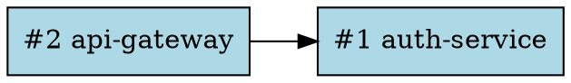

# stAirCase — Getting Started Guide

> **One binary. No Python. AI agents on your codebase — behind an approval gate.**

stAirCase runs multi-agent LLM swarms against your source repositories. You describe *what* to build in plain English; a supervisor agent routes specialised agents that read, reason about and propose changes to your code — and a human-in-the-loop approval gate decides every change before it lands.

**Evaluation safety:** read [Project Use and Current Safety Boundary](docs/project-use.md)
before a live run. Runs work in their own git worktree (your checkout is never
touched), but approved shell commands are not OS-sandboxed, and a run marked
`SUCCESS` does not accept user stories: after independently checking the result,
use `staircase story accept <story-id>`.

---

## Table of Contents

1. [Prerequisites](#1-prerequisites)
2. [Build & Install](#2-build--install)
3. [Smoke Test (no API key)](#3-smoke-test-no-api-key)
4. [Tutorial A — PaymentService Feature](#4-tutorial-a--paymentservice-feature)
5. [Tutorial B — Multi-Service Microservices DAG](#5-tutorial-b--multi-service-microservices-dag)
6. [LLM Providers & Model Selection](#6-llm-providers--model-selection)
7. [Human-in-the-Loop Deep Dive](#7-human-in-the-loop-deep-dive)
8. [Quality Gates Reference](#8-quality-gates-reference)
9. [Inspecting Runs & the SOC2 Event Log](#9-inspecting-runs--the-soc2-event-log)
   - [Blueprints & Drift Supervision](#9a-blueprints--drift-supervision)
10. [Maintenance](#10-maintenance)
11. [Troubleshooting](#11-troubleshooting)
12. [Command Reference](#12-command-reference)

---

## 1. Prerequisites

| Requirement | Minimum | Notes |
|---|---|---|
| Go | 1.26+ | Only to build from source |
| git | 2.x | Must be on `$PATH` |
| A model API key | — | Anthropic, OpenAI, Google, xAI, or an OpenAI-compatible LLM gateway; not needed for the smoke test |

There is nothing else to install: the agent runtime is built into the `staircase` binary.

---

## 2. Build & Install

Release binaries (Linux and macOS, amd64 and arm64; Windows amd64 as an
untested, experimental build) are attached to each
[GitHub release](https://github.com/b070nd/stAirCase/releases) — verify them as
shown below — and installable with Homebrew:

```bash
brew install b070nd/staircase/staircase
```

Or build from source:

```bash
# Clone and build
git clone https://github.com/b070nd/stAirCase.git
cd stAirCase

CGO_ENABLED=0 go build -o staircase ./src/cmd/staircase/
sudo mv staircase /usr/local/bin/
```

Verify:
```
$ staircase version
stAirCase dev (commit none, built unknown)
```

The single static binary ships with no CGo; it uses a pure-Go SQLite driver. No shared libraries required.

### Verifying release artifacts

Tagged releases are built reproducibly by the release workflow and ship a syft
SBOM (`*.spdx.json`) per archive, a Sigstore keyless signature over
`checksums.txt` (a `checksums.txt.sigstore.json` bundle), and a GitHub
build-provenance attestation for every archive. To verify a download:

```bash
# 1. Verify the checksum file signature (keyless — no public key to manage)
cosign verify-blob \
  --bundle checksums.txt.sigstore.json \
  --certificate-identity-regexp '^https://github.com/b070nd/stAirCase/\.github/workflows/release\.yml@refs/tags/v' \
  --certificate-oidc-issuer https://token.actions.githubusercontent.com \
  checksums.txt
# (v0.2.0 ships checksums.txt.sig and checksums.txt.pem instead of the bundle:
#  use --signature checksums.txt.sig --certificate checksums.txt.pem.)

# 2. Verify the archive against the now-trusted checksums
shasum -a 256 -c checksums.txt --ignore-missing

# Or, with the GitHub CLI: check the archive was built by this repository's
# release workflow (SLSA build provenance)
gh attestation verify staircase_0.2.0_darwin_arm64.tar.gz --repo b070nd/stAirCase
```

---

## 3. Smoke Test (no API key)

This section verifies every layer works correctly without spending a single API token.
(For a complete offline run — agents, approvals and a commit — see `make demo`.)

### 3.1 — Initialize the workspace

```bash
export STAIRCASE_DIR="$HOME/.staircase"
staircase init
```

Expected output:
```
Initializing stAirCase in: /home/you/.staircase
✅ SQLite Database initialized and schema verified.
🔑 Workspace encryption key ready.
🔏 Audit signing key ready.

🎉 stAirCase Workspace initialized. Ready to orchestrate.
```

### 3.2 — Doctor: verify all subsystems

```bash
staircase doctor
```

Expected output (all green):
```
🩺 stAirCase Doctor — workspace: /home/you/.staircase

  ✅ Workspace directory exists
  ✅ Workspace encryption key (.key)
  ✅ SQLite database (workspace.db)
  ✅ Database schema verified
  ✅ git in PATH (git version 2.45.1)
  ℹ️  tmp/ directory — created on first run

✅ All checks passed. Ready to orchestrate.
```

### 3.3 — Register a vendor + project

For the smoke test, use any git repository on your machine. We will **not** run it, just verify the data pipeline.

```bash
# Use an existing local repo, or create a throwaway one
mkdir -p /tmp/my-app && cd /tmp/my-app && git init && touch README.md && git add . && git commit -m "init"

staircase vendor add acme
# ✅ Vendor #1 "acme" created.

staircase project add acme my-app --source /tmp/my-app
# ✅ Project #1 "my-app" created under vendor "acme".
#    Source path: /tmp/my-app
```

### 3.4 — Register a topology

A *topology* defines the agent graph: which agents exist and which may hand work to which.

```bash
staircase topology register 1 supervisor
# ✅ Topology #1 v1 created  supervisor="supervisor"  checkpoint=memory  runtime=langgraph

staircase topology agent add 1 supervisor "Route work to the coder; route to END when done." --model claude-sonnet-4-6
staircase topology agent add 1 coder "Read the code, then make precise, minimal changes." --model claude-sonnet-4-6

staircase topology edge add 1 supervisor coder
staircase topology edge add 1 coder supervisor
```

How a run moves through this graph: the supervisor goes first. Each agent works
with its tools until it answers without calling one, then ends its reply with
`ROUTE: <next>`, naming one of its edges (the supervisor may also say `END`).
Every agent is told its choices. An agent with a single edge simply follows it,
so here the coder always hands back to the supervisor, and the supervisor ends
the run. Runs stop after 25 agent steps or 100 model calls. (`--checkpoint` and
`--runtime` are kept for compatibility and do not change anything.)

Verify the graph:
```bash
staircase topology show 1
```
```
Topology #1  v1  project #1
  Supervisor:  supervisor
  Checkpoint:  memory
  Runtime:     langgraph

  Agents (2):
    #1 supervisor            model=claude-sonnet-4-6               role=Route work to the coder; route to END when done.
    #2 coder                 model=claude-sonnet-4-6               role=Read the code, then make precise, minimal changes.

  Edges (2):
    supervisor → coder
    coder → supervisor
```

### 3.5 — Create a case and set a PRD

A *case* is a bounded unit of work. Its PRD (Product Requirements Document) is the prompt the swarm acts on; its *stories* are what you will accept at the end.

```bash
staircase case new 1
# ✅ Case #1 created (project #1) — status: PENDING

cat > /tmp/prd.txt << 'EOF'
Add a /healthz HTTP endpoint that returns {"status": "ok", "version": "1.0"}
EOF

staircase case set-prd 1 /tmp/prd.txt
# ✅ PRD loaded into Case #1 (77 bytes).

staircase story add 1 'GET /healthz returns 200 with {"status":"ok"}'
# ✅ Story #1 added to Case #1 — status: PENDING
```

### 3.6 — Compile (no API calls)

`compile` turns the topology and case into a *plan*: the agents, their prompts and models, the edges, the PRD and a map of the repository. Zero API calls — it's purely local.

```bash
staircase compile 1
```
```
⚙️  Compiling case #1  project="my-app"
   📦 Dependency order: my-app
   🕸  Topology v1  supervisor="supervisor"  checkpoint=memory
   ✅ Generated: /home/you/.staircase/tmp/plan_case1.json
   🚀 Run with:  staircase run 1
```

The plan is plain JSON — read it to see exactly what the agents will be given:
```bash
cat "$STAIRCASE_DIR/tmp/plan_case1.json"
```

It is checksummed: `run` refuses a plan that was edited after compile, belongs to another case, or was written by another staircase version (recompile with `--force`). Unknown extra tools or a model no provider serves fail at compile.

### 3.7 — Run quality gates

```bash
staircase gate 1
```
```
Quality Gate Report — case #1

CATEGORY      GATE                                  SEVERITY   STATUS  MESSAGE
──────────────────────────────────────────────────────────────────────────────
dependency    deps.no_cycle                         BLOCK      ✅ PASS    dependency graph is acyclic (1 projects, 0 edges)
dependency    deps.deps_completed                   WARN       ✅ PASS    no project dependencies configured

runtime       runtime.plan_compiled                 BLOCK      ✅ PASS    plan for topology v1, 2 agents
runtime       runtime.source_path                   BLOCK      ✅ PASS    source path "/tmp/my-app" exists
runtime       runtime.no_concurrent_run             BLOCK      ✅ PASS    no concurrent runs
runtime       runtime.git_available                 BLOCK      ✅ PASS    git found in PATH

security      secret.provider_keys                  BLOCK      ❌ FAIL    ANTHROPIC_API_KEY missing — printf 'value' | staircase secret set ANTHROPIC_API_KEY
security      secret.key_file                       BLOCK      ✅ PASS    .key present, 32 bytes, mode 0600
security      secret.no_duplicate_keys              WARN       ✅ PASS    no duplicate secret keys

structural    case.project_exists                   BLOCK      ✅ PASS    case 1 → project "my-app" (id=1)
structural    case.has_stories                      BLOCK      ✅ PASS    1 PENDING stories
…
Overall: ❌ FAIL
Summary: 17 pass, 0 warn, 1 fail, 0 skip
```

The one failure is expected in a smoke test: live runs need the key of every
provider the topology's models use. Store it (it is encrypted in the workspace)
when you are ready — see [LLM Providers](#6-llm-providers--model-selection).

**The smoke test is complete.** You have verified the pipeline — init, topology registration, case creation, compilation and gate checks — without spending a single API token.

---

## 4. Tutorial A — PaymentService Feature

**Scenario:** You're building a payments API. You want stAirCase to add Stripe webhook signature verification to your existing FastAPI service using a 3-agent swarm: supervisor routes, a coder implements, a reviewer checks for security issues.

### 4.1 — Setup (one time per machine)

```bash
export STAIRCASE_DIR="$HOME/.staircase"
staircase init
printf %s "$ANTHROPIC_API_KEY" | staircase secret set ANTHROPIC_API_KEY
```

Secrets are read from stdin (never from the command line, where shell history and
`ps` would see them), encrypted with AES-256-GCM and stored in the workspace
database. A model key is decrypted only to call the model, never shown to it, and
scrubbed from every log and audit record.

### 4.2 — Register the project

```bash
# Assumes you have a local clone of your payments repo
staircase vendor add mycompany
staircase project add mycompany payments-api --source /home/you/code/payments-api
# ✅ Project #1 "payments-api" created under vendor "mycompany".
```

### 4.3 — Design the agent topology

```bash
# Register topology (supervisor name must match the agent you register as supervisor)
staircase topology register 1 supervisor

# Supervisor — routes work, decides when to finish
staircase topology agent add 1 supervisor \
  "You are the orchestrator. Analyse the PRD and repo context, then route to 'coder' to implement and 'reviewer' to verify. Call 'coder' first, then 'reviewer'. When reviewer approves, route to END." \
  --model claude-opus-4-6

# Coder — implements changes
staircase topology agent add 1 coder \
  "You are a senior Python engineer. Use list_dir and read_file to understand the codebase, then use request_edit to make precise, minimal changes. Focus only on what the PRD requests." \
  --model claude-sonnet-4-6

# Reviewer — security and correctness review
staircase topology agent add 1 reviewer \
  "You are a security-focused code reviewer. Use read_file to inspect changes. Check for: injection vulnerabilities, missing input validation, secrets in code, and correctness. Reply APPROVED or CHANGES NEEDED with specific feedback." \
  --model claude-sonnet-4-6

# Edges — the supervisor can hand work to either agent; both hand back
# (each agent ends its turn with "ROUTE: <next>"; the supervisor says END to finish)
staircase topology edge add 1 supervisor coder
staircase topology edge add 1 supervisor reviewer
staircase topology edge add 1 coder supervisor
staircase topology edge add 1 reviewer supervisor
```

### 4.4 — Create a case with the feature PRD

```bash
staircase case new 1
# ✅ Case #1 created for project #1

cat > /tmp/stripe-webhook-prd.md << 'EOF'
## Feature: Stripe Webhook Signature Verification

**Goal**: Add HMAC-SHA256 signature verification to the existing /webhooks/stripe
endpoint in app/routes/webhooks.py.

**Requirements**:
1. Read STRIPE_WEBHOOK_SECRET from environment (already set by ops team)
2. Verify the Stripe-Signature header using stripe.Webhook.construct_event()
3. Return HTTP 400 with {"error": "invalid signature"} if verification fails
4. Return HTTP 400 with {"error": "payload too large"} if body > 512KB
5. Existing webhook handling logic must remain unchanged
6. Add a unit test in tests/test_webhooks.py covering both the happy path
   and the signature failure case

**Do not**:
- Change any other routes
- Add new dependencies (stripe-python is already in requirements.txt)
- Modify the database layer
EOF

staircase case set-prd 1 /tmp/stripe-webhook-prd.md
staircase story add 1 "Verify Stripe-Signature header using HMAC-SHA256"
staircase story add 1 "Reject oversized payloads (>512KB) with HTTP 400"
staircase story add 1 "Unit tests cover happy path and signature failure"
```

### 4.5 — Add user stories for tracking

```bash
staircase story list 1
```
```
ID  Status   Description
────────────────────────────────────────────────────────────────────
1   PENDING  Verify Stripe-Signature header using HMAC-SHA256
2   PENDING  Reject oversized payloads (>512KB) with HTTP 400
3   PENDING  Unit tests cover happy path and signature failure
```

### 4.6 — Compile + gate

```bash
staircase compile 1
staircase gate 1
```

If all gates pass:
```
✅  All BLOCK gates passed. Safe to run.
```

### 4.7 — Run

```bash
staircase run 1
```
```
🚀 Run #1  case=1  branch=main
   🌿 Run branch staircase/run-1 in worktree /home/you/.staircase/worktrees/run-1
```

The swarm is now running — in its own git worktree on the `staircase/run-1`
branch, created from your current commit. Your checkout is never touched, and
uncommitted changes in it are not visible to the agents (staircase tells you
when there are some).

### 4.8 — Human-in-the-Loop approval

When an agent proposes a change — `request_edit`, `create_file` or `delete_file`
(or `run_shell` in a run started with `--allow-shell-exec`) — stAirCase pauses and
presents a TUI:

```
╔══════════════════════════════════════════════════════════╗
║  HITL YIELD REQUEST                              Run #1  ║
╠══════════════════════════════════════════════════════════╣
║  Agent:    coder                                         ║
║  Action:   file_edit                                     ║
║  File:     app/routes/webhooks.py                        ║
║  Confidence: 0.94                                        ║
╠══════════════════════════════════════════════════════════╣
║  Reasoning:                                              ║
║  Adding stripe.Webhook.construct_event() verification    ║
║  at the top of the handler, before any DB operations.    ║
║  Using raw request body as required by Stripe's SDK.     ║
╠══════════════════════════════════════════════════════════╣
║  [A]pprove   [R]eject   [F]eedback                       ║
╚══════════════════════════════════════════════════════════╝
```

Press **A** to approve. What you approve is exact: stAirCase derives the file's
resulting bytes itself (a new file's full content, or a search-and-replace on the
current approved text), records your decision on the audit chain, and the tool
writes exactly those bytes. Press **R** to reject or **F** to send feedback to
the agent. A proposal that cannot apply as shown (a missing search text, a path
outside the project, a file over 200 KiB) is refused before you see it.

### 4.9 — After the run

On success, stAirCase commits exactly the approved bytes to `staircase/run-1` —
the commit is built from your approvals, and the run fails instead if the worktree
holds anything else. The worktree is removed; the branch is the deliverable.
Review and merge:

```bash
cd /home/you/code/payments-api
git diff main..staircase/run-1
git checkout main
git merge --no-ff staircase/run-1 -m "feat: stripe webhook verification (staircase run #1)"
```

A successful run does not accept stories. After you have reviewed the change and
run your own checks, accept each story — it is recorded on the run's audit chain,
and the case completes once every story is accepted:
```bash
staircase story accept 1
staircase story accept 2
staircase story accept 3
```

---

## 5. Tutorial B — Multi-Service Microservices DAG

**Scenario:** You have two Go microservices: `auth-service` and `api-gateway`. `api-gateway` depends on `auth-service` (it calls auth APIs). You want a single case that can read context from both when making changes to the gateway.

### 5.1 — Register both services

```bash
staircase vendor add mycompany   # (if not already done)

staircase project add mycompany auth-service --source /home/you/code/auth-service
# ✅ Project #1 "auth-service" created

staircase project add mycompany api-gateway --source /home/you/code/api-gateway
# ✅ Project #2 "api-gateway" created
```

### 5.2 — Declare the dependency

```bash
# api-gateway (#2) depends on auth-service (#1)
staircase project dep add 2 1
# ✅ Dependency #1: project #2 → project #1
```

### 5.3 — Visualise the DAG

```bash
staircase dag viz
```

```dot
digraph staircase {
  rankdir=LR;
  node [shape=box, style=filled, fillcolor=lightblue];
  "auth-service" [label="#1 auth-service"];
  "api-gateway" [label="#2 api-gateway"];
  "api-gateway" -> "auth-service";
}
```

Pipe to `dot` to render:
```bash
staircase dag viz | dot -Tpng -o dag.png && open dag.png
```

### 5.4 — Register topology on the gateway project

```bash
staircase topology register 2 supervisor
staircase topology agent add 2 supervisor "Route to coder to implement. Route to END when done." --model claude-opus-4-6
staircase topology agent add 2 coder "Senior Go engineer. Read both services' code via list_dir and read_file before making changes." --model claude-sonnet-4-6
staircase topology edge add 2 supervisor coder
staircase topology edge add 2 coder supervisor
```

### 5.5 — Create and compile a case

```bash
staircase case new 2
# ✅ Case #1 created for project #2

cat > /tmp/gateway-prd.txt << 'EOF'
Add a /auth/validate-token proxy endpoint to api-gateway that:
1. Forwards the Authorization header to auth-service's /internal/validate endpoint
2. Caches successful validation results for 30 seconds using a simple in-memory TTL map
3. Returns 401 if auth-service returns non-2xx
EOF

staircase case set-prd 1 /tmp/gateway-prd.txt
staircase compile 1
```

During `compile`, stAirCase:
1. Traverses the dependency DAG: `api-gateway → auth-service`
2. Generates a `RepoMap` skeleton of **both** services
3. Packs the combined context into the plan as `<context>` XML

The coder agent sees the auth-service's `internal/validate` endpoint signature without any manual prompt engineering.

```
⚙️  Compiling case #1  project="api-gateway"
   📦 Dependency order: auth-service → api-gateway
   🕸  Topology v1  supervisor="supervisor"  checkpoint=memory
   ✅ Generated: /home/you/.staircase/tmp/plan_case1.json
```

### 5.6 — Run

```bash
staircase gate 1
staircase run 1
```

---

## 6. LLM Providers & Model Selection

stAirCase supports multiple LLM providers **per agent** — different agents in the same swarm can use different vendors. The provider is inferred from the model name; the clients are built in (plain HTTPS), so there is nothing to install.

### Supported providers

| Model name | Provider | Secret key name |
|---|---|---|
| `claude-*` | Anthropic | `ANTHROPIC_API_KEY` |
| `gpt-*`, `o1-*`, `o3-*`, `o4-*` | OpenAI | `OPENAI_API_KEY` |
| `gemini-*` | Google | `GOOGLE_API_KEY` |
| `grok-*` | xAI | `XAI_API_KEY` |
| `<provider>/<model>` (e.g. `openai/gpt-6-astra`) | an OpenAI-compatible LLM gateway — [Vercel AI Gateway](https://vercel.com/ai-gateway) by default | `LLM_GATEWAY_API_KEY`; optional `LLM_GATEWAY_URL` |

The `secret.provider_keys` gate blocks a run until every provider the topology uses has its key.

### Registering API keys

Keys are read from stdin, never from the command line:

```bash
# Anthropic (Claude)
printf %s "$ANTHROPIC_API_KEY" | staircase secret set ANTHROPIC_API_KEY

# OpenAI
printf %s "$OPENAI_API_KEY" | staircase secret set OPENAI_API_KEY

# Google (Gemini)
printf %s "$GOOGLE_API_KEY" | staircase secret set GOOGLE_API_KEY

# xAI (Grok)
printf %s "$XAI_API_KEY" | staircase secret set XAI_API_KEY

# An LLM gateway (any provider/model it serves); the URL defaults to Vercel's
printf %s "$AI_GATEWAY_API_KEY" | staircase secret set LLM_GATEWAY_API_KEY
printf %s "https://gateway.example/v1" | staircase secret set LLM_GATEWAY_URL   # optional
```

Secrets are encrypted with AES-256-GCM and stored in `workspace.db`; a key is decrypted only to call its provider. Add `--project <id>` to scope a secret to one project.

### Record once, replay offline

`staircase run <case> --record-llm run.jsonl` writes every model exchange of a
run to a file; `--replay-llm run.jsonl` answers the models from it — offline,
free and deterministic. A replay fails loudly on any request the recording does
not contain (a changed prompt, plan or file), rather than answering wrongly.

### Current model recommendations

| Use case | Recommended model | Notes |
|---|---|---|
| Supervisor / orchestration | `claude-opus-4-6` | Best reasoning, highest token cost |
| Code implementation | `claude-sonnet-4-6` | Strong code quality, good speed |
| Fast routing / review | `claude-haiku-4-6` | Low latency, lowest cost |
| OpenAI alternative (coding) | `gpt-4o` | Strong multi-language support |
| Budget OpenAI | `gpt-4o-mini` | Very fast, very cheap |
| Google alternative | `gemini-2.0-flash` | Excellent speed/cost ratio |
| xAI | `grok-3` | Strong at code, large context |

### Mixed-provider example

Different agents in the same topology can use different providers:

```bash
staircase topology register 1 supervisor

# Orchestration: use Claude Opus for best reasoning
staircase topology agent add 1 supervisor \
  "Route tasks to coder or reviewer. Call END when reviewer approves." \
  --model claude-opus-4-6

# Implementation: use GPT-4o as the coder
staircase topology agent add 1 coder \
  "Senior engineer. Read the codebase, then edit files to implement the PRD." \
  --model gpt-4o

# Review: Gemini Flash for fast, cheap review passes
staircase topology agent add 1 reviewer \
  "Security reviewer. Check for vulnerabilities and correctness. Reply APPROVED or CHANGES NEEDED." \
  --model gemini-2.0-flash

staircase topology edge add 1 supervisor coder
staircase topology edge add 1 supervisor reviewer
staircase topology edge add 1 coder supervisor
staircase topology edge add 1 reviewer supervisor
```

Each agent fetches only its provider's key — a coder using `gpt-4o` only needs `OPENAI_API_KEY`; it never touches `ANTHROPIC_API_KEY`.

### Project-scoped secrets

If different projects use different API keys (e.g., separate billing accounts):

```bash
printf %s "$TEAM_A_KEY" | staircase secret set ANTHROPIC_API_KEY --project 1
printf %s "$TEAM_B_KEY" | staircase secret set ANTHROPIC_API_KEY --project 2
```

Project-scoped secrets take precedence over the global fallback.

---

## 7. Human-in-the-Loop Deep Dive

### Interactive TUI (default)

When running interactively, each proposal (an edit, a new or deleted file, or a shell command) pauses the swarm and shows the approval TUI. You have three options:

| Key | Action |
|-----|--------|
| `A` | Approve — exactly the shown change is applied, swarm continues |
| `R` | Reject — nothing is applied; the reason is sent to the agent |
| `F` | Feedback — enter a text message guiding the agent, then it retries |

For approvals from another machine or a script, start the run with
`--approval-port <port>`: it serves `GET /v1/yields` and
`POST /v1/yields/<id>/approve|reject` behind a bearer token.

### Webhook mode (CI/CD integration)

For automated pipelines, set a webhook URL on the project. stAirCase will POST yield requests to your endpoint and expect a synchronous JSON response:

```bash
staircase project set-webhook 1 https://your-review-bot.internal/staircase/yield
```

Your endpoint receives:
```json
{
  "type": "yield_request",
  "agent_name": "coder",
  "action_type": "file_edit",
  "reasoning_trace": "Adding signature verification before DB call",
  "confidence_score": 0.94
}
```

Respond with:
```json
{
  "type": "yield_response",
  "approved": true,
  "feedback": ""
}
```

Or to reject with guidance:
```json
{
  "type": "yield_response",
  "approved": false,
  "feedback": "Do not modify the handler signature — keep the existing FastAPI dependency injection"
}
```

Clear the webhook to return to TUI mode:
```bash
staircase project set-webhook 1
```

With a webhook secret stored as `__webhook_hmac_secret__` for the project, requests
and responses are HMAC-signed, and your response must echo the request's
`yield_id` and `request_sha256` — so a captured approval cannot be replayed.

### Your checkout is never touched

Every run works in its own git worktree under `$STAIRCASE_DIR/worktrees/`, on a
new `staircase/run-N` branch created from your current commit — there is nothing
to stash. Uncommitted changes in your checkout are simply not visible to the
agents; commit what they should see before `compile`/`run`.

---

## 8. Quality Gates Reference

`staircase gate <case-id>` runs 18 built-in quality checks in 4 categories (plus any plugin gates). Gates with severity `BLOCK` must pass for `staircase run` to proceed.

### Categories

| Category | What it checks |
|---|---|
| `structural` | Case, PRD and stories present; topology registered, agents and edges valid, supervisor registered |
| `security` | Workspace key present and private, a key for every model provider used, no duplicate secrets |
| `runtime` | Plan compiled, unmodified and for the current topology; source path exists; no concurrent run; git available |
| `dependency` | DAG is acyclic, upstream projects done |

### Machine-readable output

```bash
staircase gate 1 --json
staircase gate 1 --json --out report.json
```

### Bypassing in emergencies

```bash
staircase run 1 --skip-gates   # use with care; documents your override intent
```

### Dry-run validation

```bash
staircase run 1 --dry-run
```

Validates the case and prints where the run would go (a new worktree from which commit) without creating anything or spending tokens.

---

## 9. Inspecting Runs & the SOC2 Event Log

### List all runs

```bash
staircase inspect runs
staircase inspect runs --case 1
```
```
ID  Case  Status   Branch  Topo  Started           Duration
──  ────  ───────  ──────  ────  ────────────────  ────────
1   1     SUCCESS  main    1     2026-09-24 23:25  0s
```

(`Branch` is the branch your checkout was on; the run's own branch is `staircase/run-<ID>`.)

### Verify the tamper-proof event log

Every step of a run — what it started from, each model call's usage, each
proposal and its decision, and why finalize committed or refused — is written to
an append-only event log. Each entry is hash-chained with SHA-256 and the chain is
Ed25519-signed; delivered secrets are scrubbed from every payload.

```bash
staircase inspect log 1
```
```
Run #1  case=#1  status=SUCCESS  branch=main
         commit=a4b7beaa1bd24afabd9d9eb0b3ae05f3be3d3d97

✅ #1     run_bound       23:25:23  c66171a087a160e2…
     {"base_sha":"42086b7921305dcb5fb495d843c1d9def72a7b37","branch":"staircase/run-1","topology_version":1,"type":"run_bound… (--full to see complete payload)
✅ #2     state_emit      23:25:23  45db10dce0f66229…
     {"active_agent":"supervisor","state":{"model":"claude-sonnet-4-6","input_tokens":120,"output_tokens":40,"content":"Cod… (--full to see complete payload)
✅ #3     state_emit      23:25:23  94e05696f08bde4b…
     {"active_agent":"coder","state":{"model":"claude-sonnet-4-6","input_tokens":120,"output_tokens":40,"has_tool_calls":tr… (--full to see complete payload)
✅ #4     yield_request   23:25:23  bf77b784be293088…
     {"type":"yield_request","agent_name":"coder","action_type":"file_edit","proposed_edits":[{"file":"GREETING.md","search_b… (--full to see complete payload)
✅ #5     yield_decided   23:25:23  93a3546b2b43ea7f…
     {"action_type":"file_edit","agent":"coder","approved":true,"base_sha":"42086b7921305dcb5fb495d843c1d9def72a7b37","feedba… (--full to see complete payload)
…

✅ Hash chain intact (7 entries).
```

If an entry was tampered with after the fact:
```
❌ #5    yield_decided  — TAMPERED
❌ Hash chain BROKEN — log may have been tampered with!
```

View full payloads (not truncated):
```bash
staircase inspect log 3 --full
```

---

## 9a. Blueprints & Drift Supervision

Instead of registering a topology, cases and stories by hand, keep them as a
**blueprint** in their own repository, import it as a content-hash snapshot,
and bind it to a project:

```bash
staircase blueprint import ~/blueprints/payments     # prints the hash
staircase project bind 1 <hash>                      # new topology version + the blueprint's cases
staircase compile <case-id>
```

A bound case runs only as its blueprint defines it (the `runtime.plan_pinned`
gate), and every run records the plan and blueprint it executed. Stories carry a
**scope** — the paths their runs may change — and the blueprint (or
`policy.json`) sets limits. Changes outside the scope, past the file limits or at
checkpoints go to you marked `DRIFT`; too many scope violations or too long a
run halt it until you pass `--ack-drift`. `--validator <model>` lets a model
review in-scope edits, with you approving the run's final change once.

Details: [docs/blueprints.md](docs/blueprints.md), [docs/drift.md](docs/drift.md).
For an unbound case, set a story's scope with
`staircase story scope <story-id> --allow 'src/payments/**'`.

---

## 10. Maintenance

### Clean up

```bash
# Remove what older staircase versions left in tmp/ (compiled Python scripts, sockets)
staircase clean

# Also remove the Python venv of older versions and staircase/run-* branches older than 30 days
staircase clean --aggressive

# Forensic mode: preserve FAILED run branches for post-mortem
staircase clean --aggressive --keep-failed

# Preview without deleting
staircase clean --aggressive --dry-run
```

A failed or killed run keeps its worktree for inspection (`staircase case rollback`
removes it together with the run branch).

### Rotate secrets

```bash
printf %s "$NEW_ANTHROPIC_API_KEY" | staircase secret set ANTHROPIC_API_KEY
```

Replaces the existing encrypted value (the output says `replaced`, with the
secret's version). All future runs use the new key.
(`staircase secret rotate` re-encrypts every secret under a new workspace key.)

### List stored secrets

```bash
staircase secret list
```
```
Key                   Scope
───────────────────────────────────────────
ANTHROPIC_API_KEY     (global)
STRIPE_SECRET_KEY     project #1
```

### Re-compile after a topology change

If you update the topology (add an agent, change a role), the compiled plan is stale. The `runtime.plan_compiled` gate warns about it:

```bash
staircase topology agent add 1 tester "Write and run tests" --model claude-haiku-4-6
staircase topology edge add 1 supervisor tester
staircase topology edge add 1 tester supervisor

staircase gate 1    # ⚠️ runtime.plan_compiled — plan was compiled for topology v1 but current topology is v2

staircase compile 1 --force
staircase gate 1    # ✅ all clear
```

---

## 11. Troubleshooting

### `workspace key has insecure permissions`

```
Error: workspace key "/home/you/.staircase/.key" has insecure permissions 0644
```

Fix:
```bash
chmod 600 "$STAIRCASE_DIR/.key"
```

### `case #1 is not compiled`

```
Error: case #1 is not compiled — run 'staircase compile 1' first
```

Compile before the first run, and again (with `--force`) after changing the
topology or the case:
```bash
staircase compile 1 --force
```

A plan edited by hand, compiled for another case, or written by another staircase
version is refused the same way; recompiling fixes it.

### `no swarm topology registered`

```
Error: no swarm topology registered for project "my-app" — run 'staircase topology register' first
```

See [Tutorial A § 4.3](#43--design-the-agent-topology) for topology setup.

### Stale `staircase/run-*` branches accumulating

```bash
staircase clean --aggressive --dry-run   # preview
staircase clean --aggressive             # delete branches older than 30 days
```

### A run was interrupted

Ctrl-C (or SIGTERM) stops the agents and records the run as KILLED; a second
Ctrl-C is ignored until the outcome is written. A run left RUNNING by a crash is
marked KILLED by the next run of the case once it is more than two hours old
(`--reconcile` also lists run branches left behind for inspection):
```bash
staircase inspect runs --case 1
```

---

## 12. Command Reference

### Global flag

```
--staircase-dir <path>   Override STAIRCASE_DIR for this invocation
```

### Workspace

```
staircase init
staircase doctor
staircase version
```

### Vendors & Projects

```
staircase vendor add <name>
staircase vendor list

staircase project add <vendor-name> <project-name> [--source <abs-path>]
staircase project list <vendor-name>
staircase project dep add <source-id> <target-id>
staircase project set-webhook <project-id> [<url>]
```

### Topology

```
staircase topology register <project-id> <supervisor-name>
staircase topology agent add <project-id> <name> <role> [--model <model>]
staircase topology edge add <project-id> <from> <to> [--condition <label>]
staircase topology tool add <agent-id> <tool-name>
staircase topology show <project-id>
```

### Cases & Stories

```
staircase case new <project-id>
staircase case set-prd <case-id> <prd-file>
staircase case list <project-id>
staircase case status <case-id>
staircase case delete <case-id>

staircase story add <case-id> <description>
staircase story list <case-id>
staircase story accept <story-id>
staircase story invalidate <story-id>
staircase story scope <story-id> [--allow <glob>]... [--max-files <n>]
```

### Blueprints

```
staircase blueprint import <dir>
staircase blueprint list
staircase project bind <project-id> <blueprint-hash>
```

### Secrets

```
printf %s "$VALUE" | staircase secret set <key> [--project <id>]
staircase secret list
staircase secret rotate
```

### Build & Run Pipeline

```
staircase compile <case-id> [--force]
staircase gate <case-id> [--json] [--out <file>]
staircase run <case-id> [--dry-run] [--skip-gates] [--approval-port <port>] [--allow-shell-exec]
                        [--record-llm <file> | --replay-llm <file>] [--reconcile] [--debug]
                        [--validator <model>] [--ack-drift] [--agent built-in|claude-code]
```

### Inspection

```
staircase inspect runs [--case <id>]
staircase inspect log <run-id> [--full]
```

### DAG

```
staircase dag viz [<project-id>]
```

### Maintenance

```
staircase clean [--aggressive] [--dry-run] [--keep-failed]
```

---

## Architecture in 30 seconds

```
┌─ staircase (one Go binary) ──────────────────────────────────────┐
│  SQLite workspace.db — all state; nothing in your repositories   │
│  AES-256-GCM encrypted secrets                                   │
│  quality gates → compile (checksummed plan) → run                │
│                                                                   │
│  run: new git worktree + staircase/run-N branch                  │
│   ┌─ agents (in-process) ──────────────────────────────────┐     │
│   │  supervisor ⇄ workers, "ROUTE: <next>", models via HTTPS │     │
│   │  tools: read_file, list_dir, request_edit, create_file, │     │
│   │         delete_file (+ run_shell with --allow-shell-exec)│     │
│   └────────── every change is a proposal ──────────────────┘     │
│         ▼                                                         │
│  refuse (bad path, no match) → policy → human (TUI / API / webhook)│
│         ▼                                                         │
│  decision on the signed audit chain → tool writes approved bytes │
│  finalize: worktree must match → commit built from approvals     │
└──────────────────────────────────────────────────────────────────┘
```

**Zero-Trace Attachment**: stAirCase never writes to your checkout. Runs work in a
worktree under `$STAIRCASE_DIR/worktrees/`, and all state (plans, audit log,
secrets) lives in `$STAIRCASE_DIR`. The only footprint in your repository is the
`staircase/run-*` branch — which you merge or discard.

---

*stAirCase — one Go binary: control plane, agent runtime and audit trail.*
